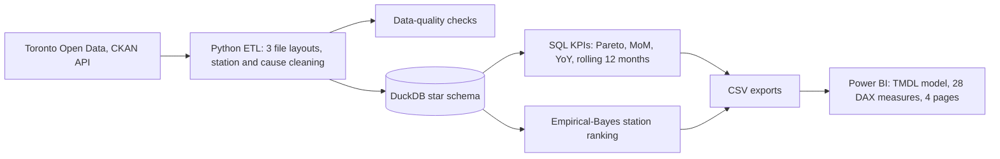

# TTC Subway Delay Analysis

Which causes and stations to act on first: a DuckDB warehouse, SQL KPIs and a Power BI report built from every Toronto subway delay logged since 2014, for transit operations and performance analysts.

## Results

- **Found that 41 of 207 delay causes account for 80% of the 682,828 minutes** lost on Toronto's subway since 2014, with SQL KPIs in DuckDB (Pareto, YoY, rolling 12 months) tested against hand-worked values.
- **Showed incident counts point at the wrong stations:** the 5 stations logging the most incidents rank 52nd-73rd of 74 on minutes per incident in a fair ranking (empirical Bayes, in SQL) that explains each rank change.
- **Cleaned every TTC delay file since 2014** (3 layouts and 2,000+ station-name spellings) into a DuckDB star schema with Python and pandas, leaving 0.10% of rows unmatched, with data-quality checks.
- **Built a 4-page Power BI report** (cause Pareto, station ranking, trends) on a TMDL model of 28 DAX measures, with a checker confirming each measure has a hand-tested SQL twin.

The findings, written for a non-technical manager: [FINDINGS.md](FINDINGS.md).



**Stack:** Python, pandas, DuckDB (SQL), Power BI (PBIP: TMDL semantic model, DAX), openpyxl, pytest

## Quickstart

```bash
python3 -m pip install -r requirements.txt   # pandas, duckdb, openpyxl, requests, pytest
python3 -m ttc_delay run --sample            # offline: warehouse, KPIs, quality checks and Power BI exports from the committed sample
python3 -m ttc_delay all                     # the real data: downloads every file through the CKAN API, then runs (about a minute)
```

Then open `powerbi/TTCDelay.pbip` in Power BI Desktop (step 4 below), or query `data/warehouse/ttc_delay.duckdb` directly (step 3).

## Why

Toronto Open Data publishes each logged subway delay with its time, station, line, cause code and minutes of
delay and gap. The raw files are hard to use as they are:

- Each era has its own layout: one sheet per month, one sheet per year, or a CSV export.
- Station names come in more than 2,000 spellings ("KENNEDY BD STATION - P", "SCARB CTR STATIO",
  "DUFFERIN STATON").
- Cause codes have been retired and renamed over the years.
- A raw count of incidents ranks busy stations unfairly.

This project turns the files into a clean star schema and computes the KPIs in SQL. It mirrors those KPIs as
DAX measures in a Power BI project. It also ranks stations with empirical-Bayes shrinkage, so that a station
is neither rewarded nor punished for having only a few incidents.

**Who it is for:** an operations or performance analyst at a transit agency, or a city councillor's office,
that has to decide which causes and stations to act on first and track whether reliability improves.

**What you get**

| Deliverable | Where |
|---|---|
| ETL: CKAN download, every yearly format, station normalisation, cause descriptions | `ttc_delay/` |
| Star schema in DuckDB (`fact_delay`, `dim_date`, `dim_station`, `dim_line`, `dim_cause`) | `sql/schema.sql` |
| Data-quality checks and report | `ttc_delay/quality.py`, `reports/data_quality.md` |
| KPIs in SQL: incidents, minutes, minutes/incident, cause share, MoM, YoY, rolling 12 months, Pareto | `sql/kpis.sql` |
| Empirical-Bayes station ranking compared with the naive ranking | `sql/ranking.sql`, `ttc_delay/ranking.py` |
| Power BI project (PBIP): TMDL semantic model, 28 DAX measures, 4 report pages | `powerbi/` |
| PBIP checker: well-formed files, and every DAX measure has a tested SQL twin | `tools/check_pbip.py` |
| Findings memo for a non-technical manager (real data to August 2026) | `FINDINGS.md` |
| Station matching report and list of unmatched names | `reports/station_matching.csv`, `reports/station_unmatched.csv` |

## Usage

### Install

Requires Python 3.10 or later.

```bash
python3 -m pip install -r requirements.txt     # pandas, duckdb, openpyxl, requests, pytest
# or, as a package with the `ttc-delay` command:
python3 -m pip install -e ".[dev]"
```

### 1. Offline, on the committed sample

`data/sample/` holds every 25th row of every real source file. It keeps the original file names, sheet
names and layouts (10,739 rows).

```bash
python3 -m ttc_delay run --sample
```

This builds `data/sample_build/ttc_delay.duckdb`, writes reports to `data/sample_build/reports/` and writes
the Power BI CSV exports to `data/sample_build/export/`. It also prints the data-quality checks:

```
[PASS] Row counts per year reconcile with the source files: 10,739 source rows = 10,739 loaded + 0 removed; ...
[PASS] No orphan foreign keys in fact_delay: 0 fact rows with a key missing from its dimension
[PASS] Station names resolved: 7 rows (0.07%) have a location that could not be matched; ...
[WARN] Delays over 600 minutes (kept, listed for review): 1 incidents
```

### 2. The real data (about a minute)

```bash
python3 -m ttc_delay all          # download every file via the CKAN API, then run
# or in two steps:
python3 -m ttc_delay download     # files and manifest.json go to data/raw/
python3 -m ttc_delay run
```

Outputs:

- the warehouse: `data/warehouse/ttc_delay.duckdb`
- the reports: `reports/` (data quality, KPI summary, station matching)
- the Power BI exports: `data/export/*.csv`

The run exits with status 1 if a hard data-quality check fails.

### 3. Answer a question

Which causes cost Line 2 the most minutes in 2024, and how few of them make up 80%?

```python
import duckdb
con = duckdb.connect("data/warehouse/ttc_delay.duckdb", read_only=True)
con.sql("""
    SELECT minutes_rank, cause_code, cause_description, delay_minutes,
           round(share_of_minutes, 3) AS share_pct, round(cumulative_share, 3) AS cumulative, in_pareto_80
    FROM kpi_cause
    WHERE line_scope = 'BD' AND year_scope = '2024'
    ORDER BY minutes_rank LIMIT 10
""").show()
con.sql("SELECT * FROM kpi_pareto WHERE line_scope = 'BD' AND year_scope = '2024'").show()
```

Which stations lose the most minutes per incident once small samples are allowed for?

```python
con.sql("""
    SELECT shrunk_rank, naive_rank, station_label, incidents,
           round(naive_minutes_per_incident, 2) AS naive, round(shrunk_minutes_per_incident, 2) AS shrunk,
           explanation
    FROM station_ranking WHERE period = 'Last 36 months' ORDER BY shrunk_rank LIMIT 10
""").show(max_width=250)
```

Each row's `explanation` column says in plain words why the station moved between the naive and the shrunk
ranking. For example: "Rose 13 places: shrinkage moved its rate +0.43 min; only 240 incidents, so 38% of
its gap to the line rate (3.12 min) is treated as noise."

`reports/kpi_summary.md` collects the headline tables, and `FINDINGS.md` explains them for non-technical
readers.

### 4. Open the report in Power BI Desktop

1. Run the pipeline (real data or `--sample`) so that the CSV exports exist.
2. Open `powerbi/TTCDelay.pbip` in Power BI Desktop (Windows). Older versions need the preview features
   *Power BI Project (.pbip) save option*, *Store semantic model using TMDL format* and *Store reports
   using enhanced metadata format (PBIR)* turned on.
3. Go to **Transform data → Edit parameters** and set **DataFolder** to the absolute path of the export
   folder, for example `C:\ttc-delay-analysis\data\export`. Then select **Refresh**.

There are four report pages:

- **Overview:** KPI cards and delay minutes by month and by line.
- **Cause Pareto:** columns of minutes by cause with a cumulative-share line, cards for "causes to 80%",
  and a ranked cause table.
- **Station Ranking:** a period slicer (the ranking measures show "All years" until one period is selected), the naive and shrunk rates and ranks, the shrinkage weight, the
  explanation, a naive-versus-shrunk scatter and a rank-change chart.
- **Trend:** rolling 12-month minutes by line, MoM and YoY measures, and cause-category shares by year.

The project is committed as text. `tools/build_pbip.py` generates it from one spec (tables, measures and
visuals); edit the spec and rerun it rather than hand-editing the files.

## Tests and checks

```bash
python3 -m pytest -q          # 172 tests, offline, about 6 seconds
python3 tools/check_pbip.py   # PBIP structure, DAX references, SQL twins, exports, report bindings
```

- **`tests/test_kpis.py`** compares every SQL twin of a DAX measure with values worked out by hand on
  `tests/mini_dataset.py`. That dataset has 17 rows in the three real file formats, with a duplicate, a
  misspelt station, a yard, a two-line entry, an unmatched location and an undocumented code. It also
  covers a five-station shrinkage example. The arithmetic is written out in the docstring of
  `tests/hand_values.py`.
- **Other tests** cover:
  - station cleaning and matching: interchange platforms, renamed stations, fuzzy matches (reviewed,
    unreviewed and rejected), and segments, yards and line-wide entries;
  - line and cause normalisation, including repair of mis-encoded text;
  - each file format;
  - every data-quality check, including checks that orphan keys, negative minutes and misfiled rows are
    caught;
  - ranking edge cases: full pooling when stations do not differ, and closed stations;
  - an end-to-end run on the sample;
  - the PBIP checker, which is shown to catch broken DAX, missing twins, bad indentation, bad relationships
    and missing visual fields.
- **`tools/check_pbip.py`** parses the TMDL and checks the following:
  - tables, columns, partitions, the date table and relationships;
  - every `[measure]` and `table[column]` reference in the DAX;
  - that each measure's `SqlTwin` annotation names a `view.column` that exists in the warehouse and has a
    hand-computed test case;
  - that the TMDL columns equal the exported CSV headers;
  - that every report visual binds to existing fields and fits on its page.

## Design notes

### ETL (`ttc_delay/extract.py`, `transform.py`)

- **Download** (`download.py`): queries CKAN `package_show` for package `ttc-subway-delay-data`. It keeps
  the yearly XLSX files (2014–2024), the CSV for 2025 onward and both code lists. It also records each
  datastore table's record count in `data/raw/manifest.json`.
- **Formats:** the reader handles workbooks with one sheet per month (sheet names change style every
  year), single-sheet workbooks and the datastore CSV (which adds an `_id` column and uses ISO dates).
  Dates arrive as Excel datetimes or strings, and times as text or `datetime.time`. Every row keeps its
  source file, sheet and row number.
- **Lines** (`lines.py`): more than 100 raw spellings ("YU", "YUS", "B/D", "BD LINE 2", "YU / BD", "29 DUFFERIN",
  ...) are mapped to YU, BD, SRT, SHP, MULTI (logged against several lines), OTHER (a bus or streetcar
  route) or UNKNOWN. If the line is missing or is not a subway line, it is taken from the matched station.
- **Stations** (`stations.py`) are resolved in this order:
  1. *Cleaning:* the text is upper-cased; punctuation, the word STATION and anything after it,
     truncations ("STATIO") and misspellings ("STATON", "STN") are removed. A trailing line hint
     (BD/YUS/SHP/SRT) is kept to pick the platform at interchange stations.
  2. *Curated aliases:* `reference/station_aliases.csv` maps names such as BLOOR → Bloor-Yonge (Line 1),
     YONGE BD → Bloor-Yonge (Line 2), DOWNSVIEW → Sheppard West, DUNDAS → TMU and EGLINTON WEST → Cedarvale.
  3. *Rules for non-station locations:* line-wide entries, segments between stations ("UNION STATION TO
     KING") and yards or carhouses.
  4. *Fuzzy matching:* `difflib` with a ratio of at least 0.85, checked against
     `reference/station_fuzzy_review.csv`. Accepted matches are marked reviewed, rejected ones stay
     unmatched, and new suggestions are flagged as unreviewed in the matching report.

  Canonical stations (`reference/stations.csv`) have one row per station and line, so Kennedy (Line 2)
  and Kennedy (Line 3) are separate. On the real data, 93.2% of rows resolve to a station, 6.7% to a
  known non-station location and 0.10% (267 rows) are unmatched. The unmatched names are listed in
  `reports/station_unmatched.csv`.
- **Causes** (`causes.py`): the current code list wins and the legacy workbook (subway and SRT columns)
  fills retired codes. Codes in neither list are kept as "Undocumented code". Text that was encoded
  twice ("–") is repaired. The category comes from the code's first letter (E equipment, M
  miscellaneous and customer, P plant, S security, T transportation); this is an analytical grouping.
- **Cleaning rules:**
  - Rows without a valid date or with negative minutes would be removed; none were found in the real
    data.
  - Exact duplicates on all source fields are removed (269 rows).
  - The removed counts are kept by file, year and reason, so row counts reconcile with the source.

### Star schema (`sql/schema.sql`)

```
                dim_date (date_key, date, year, month, month_start, ...)
                    |
dim_station --- fact_delay --- dim_line
(station or         |          (YU, BD, SRT, SHP, MULTI, OTHER, UNKNOWN)
 location type)  dim_cause (code, description, category, source of description)

station_ranking (period x station) --- dim_station, dim_line   [exported for Power BI]
```

- The grain of `fact_delay` is one logged incident.
- Foreign keys are declared, and the data-quality checks test for orphans independently.
- `dim_date` runs from 1 January 2014 to the last date with data. Because it ends there, year-over-year
  for a partial year compares the same calendar span (January–August 2026 against January–August 2025),
  in SQL and in DAX (`SAMEPERIODLASTYEAR`) alike.

### Data-quality checks (`ttc_delay/quality.py` → `reports/data_quality.md`)

- Row counts reconcile per year: source rows = loaded + removed.
- The 2025+ CSV matches the CKAN datastore record count.
- No foreign key is orphaned.
- Minutes are present and non-negative.
- No duplicates remain.
- Dates fall inside each file's stated period.
- At least 99% of rows have a resolved location.
- Cause codes have published descriptions.
- Delays over 600 minutes are listed for review (kept, not removed).
- Every month has data.

### KPIs (`sql/kpis.sql`)

| View | Grain | KPIs |
|---|---|---|
| `kpi_month` | line × month (complete grid, plus network `ALL`) | incidents, delay incidents, delay/gap minutes, minutes per incident, MoM, same month last year and YoY, rolling 12 months |
| `kpi_year` | line × year | the same, with a like-for-like previous year |
| `kpi_cause` | line scope × year scope × cause (scopes include `ALL`) | minutes, share, rank, cumulative share, `in_pareto_80` |
| `kpi_pareto` | line scope × year scope | causes with minutes, **causes needed to reach 80%**, their share of all causes |
| `kpi_category_year` | line × year × category | minutes and share |

- **Pareto rule:** causes are ranked by minutes, with ties broken by code. A cause counts toward the 80%
  if the causes ranked above it hold less than 80% of the minutes.
- **SQL twins:** each DAX measure carries an annotation such as `annotation SqlTwin = kpi_year.yoy_change_minutes,
  kpi_month.yoy_change_minutes`. The test suite checks each named column against hand-computed values,
  so the SQL and DAX definitions are kept in step. The measures include year-over-year
  (`SAMEPERIODLASTYEAR`), month-over-month (`DATEADD`), rolling 12 months (`DATESINPERIOD`) and a Pareto
  rank, cumulative share and "causes to 80%" that use the same tie-break as the SQL.

### Fair station ranking (`sql/ranking.sql`)

The ranked rate is **minutes of delay per logged incident** at a station: how much a typical incident there
costs. Each station's average is shrunk toward its own line's average with a normal–normal empirical-Bayes
model, using method-of-moments estimates:

```
x_i      station mean minutes per incident (n_i incidents)
mu_L     line mean = line minutes / line incidents
sigma2_L pooled within-station variance on line L
v_i      = sigma2_L / n_i                                  sampling noise of x_i
tau2     = max(0, mean_i[(x_i - mu_L)^2 - v_i])            true spread between stations
B_i      = v_i / (v_i + tau2)                              shrinkage weight (1 if tau2 = 0)
shrunk_i = (1 - B_i) * x_i + B_i * mu_L
```

- The ranking is materialised for three periods: all years, the last 36 months and the last 12 months.
- Each period shows the naive rank, the shrunk rank, the count rank, the rank change and an explanation.
- Only real stations are ranked. A station closed before a period starts (Line 3, closed July 2023) is
  left out of that period.
- `station_ranking_for(from, to)` is a DuckDB table macro, so any other window can be ranked.

## Repository layout

```
ttc_delay/          ETL, warehouse loader, data-quality checks, ranking, summary, CLI
sql/                schema.sql, kpis.sql, ranking.sql
reference/          stations, lines, curated station aliases, fuzzy-match review decisions
data/sample/        every 25th row of each real source file (offline runs and tests)
reports/            outputs of the real-data run (data quality, KPI summary, station matching)
powerbi/            TTCDelay.pbip, TTCDelay.SemanticModel (TMDL), TTCDelay.Report (PBIR)
tools/              build_pbip.py, check_pbip.py, make_sample.py
tests/              pytest suite, hand-computed datasets and values
FINDINGS.md         findings memo
```

## Data and licence

- **Data:** City of Toronto, *TTC Subway Delay Data*, published under the
  [Open Government Licence – Toronto](https://open.toronto.ca/open-data-license/). `data/sample/` is a
  subset of those files and is redistributed under the same licence.
- **Code:** MIT. No third-party code is included. The runtime dependencies (pandas, DuckDB, openpyxl,
  requests) are installed from PyPI.

## Limitations and next steps

- **Rates are per incident.** The files hold no ridership, trips or service hours, so minutes per incident
  measures severity, not frequency; service-hour data would turn the rankings into rates per train.
- **Recording practice changes over time** (about two-thirds of logged incidents record 0 minutes), so
  minutes compare across years better than incident counts.
- **Heavy tails.** Shrinkage handles small samples, not single extreme incidents: two stations top the
  last-12-month list because of one January 2026 ice-storm incident each (see `FINDINGS.md`). The normal
  approximation is rough for data this skewed; a heavy-tailed model is the natural next step.
- **Judgement calls are explicit files.** Station aliases and fuzzy-match decisions are curated in
  `reference/`; new spellings land in `reports/station_unmatched.csv` or are flagged as unreviewed. Cause
  categories by code prefix are an analytical grouping, not an official TTC one.
- **Power BI checks are structural.** `tools/check_pbip.py` validates the files, references, bindings and
  SQL twins but does not run DAX. Refreshing the report needs Power BI Desktop on Windows; it is a local PBIP
  project, not published to the Power BI service.
- **Descriptive, not a forecast.**

Project period: 2026-02-16 to 2026-03-20.
